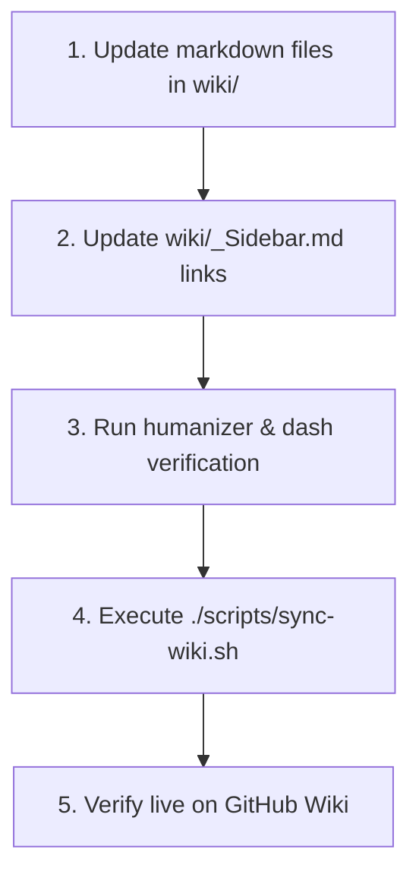

# Documentation and Wiki Maintenance

## Overview

Documentation is an essential part of the codebase. It captures why decisions were made, explains how public APIs function, and guides developers on integrating and extending Vats Editor.

This skill defines the standards, decision rubrics, and workflows for maintaining three distinct documentation layers:
1. **Core Repository Documentation (`docs/`)**: Developer guides, component API references, extension catalogs, styling guidelines, and migration instructions.
2. **Architecture Decision Records (`docs/decisions/`)**: Formal ADRs capturing the context, options evaluated, and rationale for architectural decisions.
3. **GitHub Wiki (`wiki/` & `scripts/sync-wiki.sh`)**: Formatted GitHub Wiki documentation with sidebar navigation and automated synchronization.

---

## 🚦 Decision Rubric: When to Update vs When NOT to Update

### ✅ WHEN TO UPDATE DOCUMENTATION (Green Flags)

Update documentation immediately whenever making changes that alter:

1. **Public Component APIs or Props**: Adding, modifying, or deprecating props on `EditorRoot`, `EditorContent`, `EditorBubble`, `EditorBubbleItem`, `EditorCommand`, or `ImageResizer`.
2. **Tiptap Extensions or Nodes**: Adding a new extension, updating extension options, or altering node schemas (e.g. `Mathematics`, `Twitter`, `UpdatedImage`, `UploadImagesPlugin`).
3. **Architectural Decisions**: Introducing a new state management approach, changing bundler setups, adding major dependencies, or refactoring subsystem boundaries. (Requires a new ADR in `docs/decisions/`).
4. **Styling & CSS Tokens**: Adding or modifying CSS variables, typography classes, ProseMirror DOM classes, or Tailwind plugins.
5. **Installation & Setup**: Changing package manager commands, peer dependencies, Next.js configuration, or environment variables.
6. **Breaking Changes or Migrations**: Altering existing behavior that requires downstream consumers to update their code. (Requires updating `docs/migration-guide.md`).

---

### 🛑 WHEN NOT TO UPDATE DOCUMENTATION (Red Flags & Anti-Patterns)

Do **NOT** update documentation when:

| Scenario | Why It's Forbidden | What to Do Instead |
| :--- | :--- | :--- |
| **Internal Refactoring** | Purely internal logic changes with zero public contract impact add clutter to docs. | Document inline with concise TypeScript code comments if non-obvious. |
| **Linting & Code Formatting** | Formatting fixes do not change APIs or user-facing behavior. | Commit under `chore(repo)` without modifying documentation. |
| **Intermediate Work in Progress** | Documenting half-finished features risks publishing inaccurate guidance. | Complete the feature, verify tests, and update docs atomically. |
| **Self-Explanatory Code** | Documenting trivial functions or restating variable names wastes reader time. | Keep documentation focused on non-obvious behavior, options, and gotchas. |
| **Duplicate One-Off Notes** | Scattering random notes across multiple markdown files causes docs drift. | Centralize reference material in the canonical file in `docs/` or `wiki/`. |

---

## 📋 DOs and DON'Ts (Mandatory Engineering Standards)

### ✅ DOs

- **DO use clear, direct, active voice**: Explain what the component does and why options exist without filler words.
- **DO verify code examples against real TypeScript exports**: Ensure all import paths, prop names, and hook signatures match `vats` exports.
- **DO adhere strictly to the Humanizer standard**:
  - **Zero em dashes (`—`) or en dashes (`–`)**: Use commas, periods, colons, or parentheses instead.
  - **Zero promotional AI vocabulary**: Avoid words like *delve*, *pivotal*, *testament*, *tapestry*, *vibrant*, *fostering*, *underscores*, *crucial*, *landscape*, or *groundbreaking*.
  - **Use straight quotes (`"..."`)** instead of curly quotes.
- **DO maintain `wiki/_Sidebar.md`**: When adding a new wiki page in `wiki/`, immediately register its link in `wiki/_Sidebar.md`.
- **DO update the corresponding ADR status**: When superseding a previous architectural decision, mark the old ADR as `Superseded by ADR-XXX` and link the new ADR.

---

### 🛑 DON'Ts

- **DON'T use em dashes or en dashes anywhere**: Treat this as a hard lint gate.
- **DON'T commit untested code examples**: Every code block in documentation must reflect valid TypeScript that compiles against the workspace packages.
- **DON'T delete old ADRs**: Historical context is valuable. Old ADRs must remain in `docs/decisions/` and transition from `Accepted` to `Superseded` or `Deprecated`.
- **DON'T invent fictional props or parameters**: If a feature is planned but not implemented, do not document it as available.
- **DON'T create disconnected wiki pages**: Every wiki file must be linked from `wiki/Home.md` and `wiki/_Sidebar.md`.

---

## 🏗️ Documentation Architecture & File Hierarchy

```text
vats-editor/
├── docs/                                  # Core In-Repo Documentation
│   ├── index.md                          # Documentation index & sitemap
│   ├── getting-started.md                # Installation & setup guide
│   ├── components.md                     # Component API reference
│   ├── extensions.md                     # Built-in extensions catalog
│   ├── styling.md                        # Tailwind & ProseMirror styling
│   ├── migration-guide.md                # Upgrade & migration instructions
│   └── decisions/                        # Architecture Decision Records
│       ├── ADR-001-tiptap-and-prosemirror-foundation.md
│       ├── ADR-002-isolated-store-and-event-architecture.md
│       ├── ADR-003-unified-image-upload-and-resizing-pipeline.md
│       └── ADR-004-monorepo-structure-and-tooling.md
├── wiki/                                  # GitHub Wiki Pages
│   ├── Home.md                           # Wiki Homepage
│   ├── Getting-Started.md                # Quickstart guide
│   ├── Component-API-Reference.md        # API reference
│   ├── Extensions-and-Plugins.md         # Extensions documentation
│   ├── Styling-and-Themes.md             # Styling guide
│   ├── Architecture-Decisions.md         # ADR executive summaries
│   ├── _Sidebar.md                       # Wiki navigation sidebar
│   └── _Footer.md                        # Wiki standard footer
└── scripts/
    └── sync-wiki.sh                      # Wiki push automation script
```

---

## 🏛️ Architecture Decision Records (ADR) Protocol

When making a significant technical or architectural decision, create an ADR in `docs/decisions/` following this template:

```markdown
# ADR-00X: Short Imperative Title

## Status
Accepted | Proposed | Superseded by ADR-00Y | Deprecated

## Date
YYYY-MM-DD

## Context
Describe the architectural problem, background, constraints, and requirements. Explain what challenges the team or codebase faced.

## Decision
State the chosen solution clearly. Explain the components, libraries, patterns, or data structures being adopted.

## Alternatives Considered

### Alternative 1: Name
- Pros: Specific technical advantages.
- Cons: Specific technical drawbacks.
- Reason for Rejection: Concrete explanation of why this option was not selected.

### Alternative 2: Name
- Pros: Specific technical advantages.
- Cons: Specific technical drawbacks.
- Reason for Rejection: Concrete explanation of why this option was not selected.

## Consequences
- Positive impact: What becomes easier, faster, or safer.
- Negative impact & trade-offs: What complexity or maintenance cost is incurred.
- Follow-up work: Any migrations or documentation required.
```

### ADR Numbering Rules:
1. Always continue the sequential numbering (`ADR-005-...`, `ADR-006-...`).
2. Never reuse or renumber existing ADRs.
3. Keep the file basename hyphenated lowercase: `ADR-00X-descriptive-name.md`.

---

## 🔄 GitHub Wiki Synchronization Workflow

To synchronize documentation between the repository and GitHub Wiki:



### Execution Steps:
```bash
# 1. Run automated syntax check on the sync script
bash -n scripts/sync-wiki.sh

# 2. Run the synchronization script
./scripts/sync-wiki.sh

# 3. If pushing to a custom remote URL or token
WIKI_REMOTE_URL="git@github.com:Shreyvats01/vats-editor.wiki.git" ./scripts/sync-wiki.sh
```

> [!NOTE]
> **First-Time Wiki Activation**:
> GitHub requires the repository wiki to be initialized before git pushes are accepted. If you receive a repository not found error, visit `https://github.com/Shreyvats01/vats-editor/wiki` once in your browser and save the initial page.

---

## 🛡️ Pre-Commit Verification Checklist for Documentation

Before committing any documentation or wiki changes, run this automated verification:

```bash
# 1. Scan for forbidden em/en dashes
python3 -c "
import glob, sys
files = glob.glob('docs/**/*.md', recursive=True) + glob.glob('wiki/**/*.md', recursive=True)
dashes = [f for f in files if any(d in open(f).read() for d in ['—', '–'])]
if dashes:
    print('Error: Found dashes in:', dashes)
    sys.exit(1)
print('Dash check passed!')
"

# 2. Scan for forbidden promotional AI words
python3 -c "
import glob, re, sys
banned = ['delve', 'pivotal', 'testament', 'tapestry', 'vibrant', 'fostering', 'underscores']
files = glob.glob('docs/**/*.md', recursive=True) + glob.glob('wiki/**/*.md', recursive=True)
found = []
for f in files:
    content = open(f).read()
    for w in banned:
        if re.search(r'\b' + w + r'\b', content, re.I):
            found.append((f, w))
if found:
    print('Error: Found banned words:', found)
    sys.exit(1)
print('Buzzword check passed!')
"

# 3. Run monorepo typecheck and linting
pnpm typecheck
pnpm lint
```
