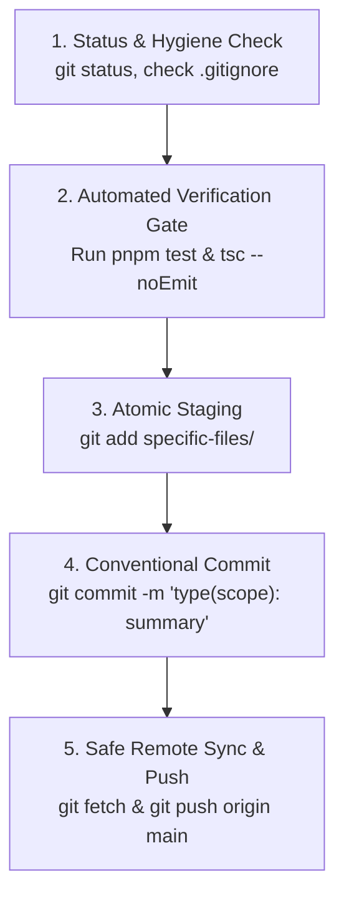

# Git Push Playbook: Safe Commits, Branching, and Push Protocols

## Overview

Version control is both a safety net and persistent documentation. Every commit must represent a **known-good, self-contained increment of progress**, and every push to a remote repository must be **verified, secret-free, and stable**.

---

## 🚦 Decision Rubric: When to Push vs When NOT to Push

### ✅ WHEN TO COMMIT & PUSH (Green Flags)

1. **Discrete Slice Completed**: A single logical feature, component, API endpoint, or bug fix is finished and self-contained.
2. **100% Tests Pass**: All automated tests (`pnpm test` / `vitest run`) pass with zero regressions.
3. **Clean Typecheck**: TypeScript compiler (`tsc --noEmit`) passes with **0 errors** across all workspace packages.
4. **Scope Discipline**: The commit touches *only* the files directly relevant to this specific task (no unsolicited formatting of unrelated files).
5. **No Secrets**: Verified with `git diff --staged` that no `.env`, API tokens, private keys, or passwords exist in the diff.
6. **Session Checkpoint / Handoff**: Ending a coding session or handing off work to another agent/engineer after reaching a verified stable state.

---

### 🛑 WHEN NOT TO COMMIT OR PUSH (Red Flags & Stop Gates)

| Condition | Why It's Forbidden | What to Do Instead |
| :--- | :--- | :--- |
| **Failing Tests** | Breaks the main branch and CI pipeline for the entire team. | Fix the root cause or revert to the last working commit before pushing. |
| **TypeScript Errors** | Causes production builds to fail (`next build` / `tsup`). | Run `tsc --noEmit` and resolve all type issues first. |
| **Secrets or `.env` in Diff** | Exposes private keys, OAuth credentials, or DB passwords permanently. | Add `.env` to `.gitignore`, run `git rm --cached <file>`, and revoke leaked keys. |
| **Mixed Concerns** | Combining a UI redesign with backend schema refactors makes rollback impossible. | Split into two atomic commits (`feat(database)` then `feat(ui)`). |
| **Build Artifacts in Staging** | Committing `.next/`, `dist/`, `node_modules/`, or `.turbo/` bloats the repo. | Ensure `.gitignore` ignores all build outputs before staging. |
| **Unresolved Conflicts** | Committing files with `<<<<<<< HEAD` markers breaks runtime execution. | Resolve merge markers, verify syntax, and test before committing. |
| **Half-Baked / Incomplete Syntax** | Committing code that cannot compile or parse. | Use local stash (`git stash`) or a temporary draft branch if saving unverified work. |

---

## 🛡️ The 5-Step Git Protocol

Follow this exact sequence for every commit and push:



---

### Step 1: Status & Pre-Commit Hygiene

Always check what files are modified and ensure no secrets or temporary files are tracked:

```bash
# 1. View untracked and modified files
git status

# 2. Check for secret keywords in staged diff
git diff --staged | grep -iE "password|secret|api_key|token|bearer|private_key"

# 3. Ensure .env files are NOT staged
git status --short | grep "\.env"
```

---

### Step 2: Automated Verification Gate

Never commit or push code that has not passed local verification:

```bash
# Run full monorepo typecheck
pnpm typecheck

# Run monorepo linting
pnpm lint

# Run monorepo build
pnpm build
```

---

### Step 3: Atomic Staging

Stage **only** the files belonging to one logical change:

```bash
# Good: Staging files for a specific feature
git add packages/headless/src/components/editor.tsx

# Avoid blanket 'git add .' if there are unrelated scratch files
```

---

### Step 4: Conventional Commit Formatting

Write clear, semantic commit messages following the Conventional Commits specification:

```text
<type>(<scope>): <short imperative description>

- <bullet point detail 1 explaining WHY>
- <bullet point detail 2 explaining WHAT>
```

#### Commit Types:
- `feat`: A new feature or capability (e.g., `feat(web): add command palette`).
- `fix`: A bug fix (e.g., `fix(editor): prevent bracket popup on single keypress`).
- `refactor`: Code change that neither fixes a bug nor adds a feature (e.g., `refactor(core): extract store context`).
- `perf`: A code change that improves performance (e.g., `perf(utils): optimize ranker loop`).
- `chore`: Tooling, dependencies, configuration, or hygiene (e.g., `chore(repo): update .gitignore`).
- `docs`: Documentation only (e.g., `docs(readme): add quickstart guide`).
- `test`: Adding or updating tests (e.g., `test(editor): add math selector unit tests`).

---

### Step 5: Safe Remote Push

Push commits to the remote repository safely:

```bash
# 1. Fetch latest changes from remote
git fetch origin

# 2. Push current branch to remote
git push origin <branch-name>

# 3. If pushing a new branch for the first time
git push -u origin <branch-name>
```

---

## 🚨 Emergency Recovery & Rollbacks

### 1. Accidentally Staged Secret or `.env` File
```bash
# Unstage the secret file immediately
git restore --staged .env

# If already committed locally (before pushing):
git reset --soft HEAD~1
git restore --staged .env
git commit -m "feat(module): clean commit without secrets"
```

### 2. Discarding Broken Unstaged Changes
```bash
# Discard all local unstaged modifications
git restore .

# Clean untracked files
git clean -fd
```

### 3. Reverting a Broken Commit on Remote
```bash
# Create a safe revert commit (preserves history without force-push)
git revert <commit-hash>
git push origin main
```
