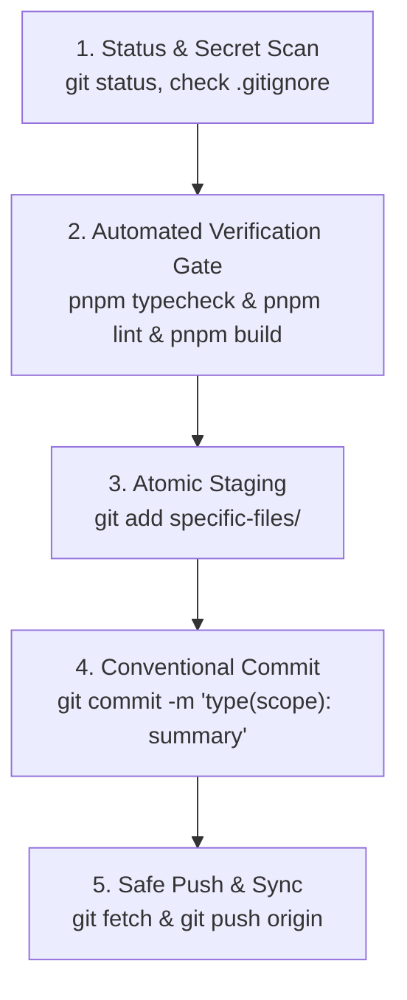

# Git Workflow, Atomic Commits, and Push Protocols

## 1. Overview and Core Philosophy

Version control serves two vital functions: it is an automated safety net for code rollback and a permanent, searchable historical log of design intent. Every commit must represent a verified, self-contained increment of working software. Every push to a remote repository must be clean, secret-free, and stable.

```text
Trunk-Based Delivery Flow:
main ──●──●──●──●──●──●──●──●──●──  (always deployable and green)
        \      /  \    /
         ●──●─/    ●──/    (short-lived feature branches, 1 to 2 days maximum)
```

---

## 2. Decision Rubric: When to Commit and When NOT to Commit

### 2.1 Green Flags: When to Commit and Push

Commit and push your work when all of the following conditions are met:
1. **Discrete Slice Completed**: A single logical component, bug fix, extension, or refactoring step is complete.
2. **Typecheck Passes**: `pnpm typecheck` succeeds with zero errors across all workspaces.
3. **Linter Passes**: `pnpm lint` reports zero errors and zero warnings.
4. **Build Succeeds**: `pnpm build` completes with production bundles generated.
5. **Clean Diff and No Secrets**: Staged files contain no `.env` files, credentials, API keys, or personal tokens.
6. **Scope Discipline**: Changes touch only the files necessary for this specific logical task.
7. **Session Checkpoint**: Ending a development session or handing off work after achieving a stable, verified state.

---

### 2.2 Red Flags: When NOT to Commit or Push (Stop Gates)

| Condition | Why It Is Forbidden | Required Corrective Action |
| :--- | :--- | :--- |
| **Failing Typecheck or Build** | Breaks CI and prevents team members from building. | Run `pnpm typecheck` and `pnpm build`; resolve all compiler issues first. |
| **Failing Linter** | Introduces code style inconsistencies and broken formatting. | Run `pnpm lint` and apply automated fixes before staging. |
| **Secrets in Diff** | Leaks private credentials, tokens, or passwords permanently. | Run `git restore --staged <file>`, ensure file is in `.gitignore`, and rotate exposed credentials. |
| **Mixed Logical Concerns** | Combining UI restyling with database schema refactoring prevents clean rollbacks. | Split changes into separate atomic commits (`feat(core)` then `feat(ui)`). |
| **Build Outputs in Staging** | Committing `dist/`, `.next/`, `node_modules/`, or `.turbo/` bloats repository size. | Verify `.gitignore` rules and unstage build artifacts via `git rm --cached -r`. |
| **Unresolved Conflict Markers** | Committing `<<<<<<< HEAD` syntax causes runtime crash. | Resolve conflict markers, test build, and verify functionality before committing. |
| **Giant Unchecked Diffs** | Committing 2000+ lines without incremental testing makes debugging impossible. | Break work into discrete 100 to 300 line atomic increments. |

---

## 3. The 5-Step Git Protocol

Follow this exact sequence for every commit and push operation:



---

### Step 1: Status and Secret Scanning

Always inspect the working tree and verify no sensitive files or unwanted artifacts are present:

```bash
# 1. Inspect modified and untracked files
git status

# 2. Check for sensitive keyword occurrences in staged diff
git diff --staged | grep -iE "password|secret|api_key|token|bearer|private_key"

# 3. Ensure no local environment files are staged
git status --short | grep "\.env"
```

---

### Step 2: Automated Verification Gate

Never stage or commit code that has not passed the full verification suite:

```bash
# 1. Check TypeScript compilation across all packages
pnpm typecheck

# 2. Run Biome linting
pnpm lint

# 3. Verify production application and package bundles
pnpm build
```

---

### Step 3: Atomic Staging

Stage only the specific files that belong to the current logical change. Avoid blanket `git add .` when unrelated scratch files or experimental drafts exist:

```bash
# Stage specific files for a single component
git add packages/headless/src/extensions/code-block.tsx
git add packages/headless/src/components/code-block-view.tsx

# View staged changes before writing commit message
git diff --staged --stat
```

---

### Step 4: Conventional Commit Formatting

Write structured commit messages following the Conventional Commits specification:

```text
<type>(<scope>): <short imperative summary>

- <bullet point explaining why the change was made>
- <bullet point explaining what was modified or added>
```

#### Allowed Types:
- `feat`: A new user-facing feature or library capability.
- `fix`: A bug fix.
- `refactor`: Code change that neither fixes a bug nor adds a feature.
- `perf`: Code change that improves runtime performance or bundle size.
- `chore`: Tooling, dependency maintenance, configuration, or repository hygiene.
- `docs`: Documentation, ADRs, or wiki page additions and updates.
- `test`: Adding or correcting automated tests.
- `build`: Changes affecting build system or external bundling configurations.
- `ci`: Continuous integration workflows and deployment actions.

#### Standard Scopes:
- `core` or `headless`: The core npm package (`packages/headless`).
- `web`: The Next.js demo playground (`apps/web`).
- `extensions`: Custom Tiptap nodes, marks, and extensions (`code-block`, `math`, `twitter`, `image`).
- `plugins`: ProseMirror plugins (`upload-images`, `keymap`).
- `ui`: UI selector components, toolbars, dialogs, and popovers.
- `styles`: CSS, Tailwind configurations, and theme tokens.
- `docs`: Developer documentation, ADRs, and wiki articles.
- `release`: Package version bumps, changelogs, and publishing.
- `repo`: Monorepo-wide configuration and root setup.

---

### Step 5: Safe Remote Push

Push commits to the remote repository after ensuring local branch is synchronized:

```bash
# 1. Fetch remote references
git fetch origin

# 2. Push to remote tracking branch
git push origin <branch-name>

# 3. Set upstream tracking on first push
git push -u origin <branch-name>
```

---

## 4. Comprehensive DOs and DON'Ts Matrix

| Category | DO | DON'T |
| :--- | :--- | :--- |
| **Commit Sizing** | **DO** keep commits focused on a single logical change (target 100 to 300 lines of diff). | **DON'T** create massive multi-thousand-line monolithic commits combining unrelated refactors. |
| **Commit Messages** | **DO** explain *why* a change was made and use Conventional Commits format. | **DON'T** use vague messages like "fix stuff", "updates", "wip", or "final fixes". |
| **Verification** | **DO** run `pnpm typecheck`, `pnpm lint`, and `pnpm build` before staging code. | **DON'T** commit code that fails compiler checks or generates lint warnings. |
| **Staging** | **DO** stage specific files explicitly using `git add <path>` and review `git diff --staged`. | **DON'T** use blanket `git add .` without checking for untracked debug files or secrets. |
| **Secrets** | **DO** keep `.env`, private keys, and API tokens strictly ignored in `.gitignore`. | **DON'T** stage or commit credentials even temporarily with the intention of deleting later. |
| **Branching** | **DO** use short-lived branches (`feat/<name>`, `fix/<name>`) merged back within 48 hours. | **DON'T** maintain long-lived stale branches that diverge significantly from `main`. |
| **History & Force Push** | **DO** use `git revert` to undo mistakes on shared branches while preserving history. | **DON'T** force-push (`git push --force`) to `main` or rewrite shared upstream branch history. |
| **Scope Discipline** | **DO** modify only the files directly required for the designated feature or fix. | **DON'T** apply unsolicited global formatting across unrelated files in the same commit. |
| **Merge Conflicts** | **DO** resolve conflicts cleanly, verify build integrity, and re-run all test suites. | **DON'T** leave raw conflict markers (`<<<<<<<`, `=======`) inside committed source files. |
| **Build Artifacts** | **DO** ensure all build outputs (`dist/`, `.next/`, `node_modules/`, `out/`) are ignored. | **DON'T** commit compiled bundles, binary artifacts, or lockfile duplicates. |

---

## 5. Branching Strategy and Naming Standards

### 5.1 Branch Naming Conventions

Use lowercase, hyphen-separated branch names with standardized category prefixes:

```text
feat/<feature-name>       -> feat/code-block-highlighter
fix/<bug-name>           -> fix/image-upload-race-condition
refactor/<module-name>   -> refactor/jotai-store-isolation
perf/<optimization>      -> perf/bubble-menu-memoization
chore/<tool-name>        -> chore/upgrade-turbo-2
docs/<topic-name>        -> docs/extension-authoring-guide
```

---

## 6. Emergency Recovery and Rollback Protocols

### 6.1 Accidental Secret Staging Recovery
```bash
# Case 1: Secret is staged but NOT yet committed
git restore --staged .env
git status

# Case 2: Secret was committed locally but NOT yet pushed
git reset --soft HEAD~1
git restore --staged .env
git commit -m "feat(module): clean commit without secret file"
# Rotate the exposed credential immediately
```

### 6.2 Discarding Broken Unstaged Changes
```bash
# Discard all modified tracked files in working directory
git restore .

# Remove untracked temporary files and directories
git clean -fd
```

### 6.3 Reverting a Broken Commit on Remote
```bash
# Create an inverted commit preserving historical log without force-push
git revert <commit-hash>
git push origin main
```

### 6.4 Stashing Work in Progress
```bash
# Save uncommitted work safely
git stash push -m "WIP: math selector refactoring"

# List stashes
git stash list

# Re-apply stashed work
git stash pop
```
