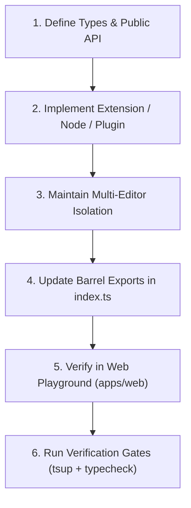

# Library Development, Release Management, and Publishing Protocol

## 1. Overview and Core Philosophy

Developing a shared library like `@vats-editor/core` requires a higher bar of architectural rigor than building an application. Changes to a library impact downstream consumers who rely on predictable public APIs, type declarations, bundle performance, and backward compatibility.

```text
Library Architecture Flow:
packages/headless/ (Core Package)
  ├── src/components/   -> Headless React primitives (EditorRoot, EditorContent, EditorBubble, EditorCommand)
  ├── src/extensions/   -> Modular Tiptap nodes & marks (CodeBlock, Mathematics, Twitter, UpdatedImage)
  ├── src/plugins/      -> ProseMirror plugins (UploadImagesPlugin, CustomKeymap)
  └── src/utils/        -> Scoped Jotai store, Markdown serializer, URL helpers
        │
        ▼ (tsup dual bundle)
      dist/
        ├── index.js    (ESM bundle)
        ├── index.cjs   (CJS bundle)
        ├── index.d.ts  (ESM TypeScript definitions)
        └── index.d.cts (CJS TypeScript definitions)
```

---

## 2. Public API Surface and Headless Design Principles

### 2.1 Headless Separation of Concerns
1. **Core is Unstyled**: `packages/headless` must provide behavior, state management, and accessibility primitives without imposing rigid CSS styles or UI component opinions.
2. **Compound Component Pattern**: Keep components composable (`EditorRoot` wraps `EditorContent`, `EditorBubble`, and `EditorCommand`).
3. **Multi-Editor Isolation**: Always scope state to the nearest `EditorRoot` using isolated Jotai store instances. Never use global singleton state that bleeds across editor instances on the same page.
4. **Explicit Barrel Exports**: Every public component, hook, utility, and TypeScript type must be cleanly exported from `packages/headless/src/index.ts`.

---

## 3. Developing Changes in the Core Package (`packages/headless`)

Follow this step-by-step procedure when modifying or adding features to the library:



### 3.1 Adding a New Extension
1. Create the extension in `packages/headless/src/extensions/<extension-name>.tsx`.
2. Define explicit configuration options interface (e.g. `CodeBlockOptions`).
3. If the extension requires a custom NodeView, create the component in `packages/headless/src/components/<component-name>.tsx` using `ReactNodeViewRenderer`.
4. Export the extension and types in `packages/headless/src/extensions/index.ts` and `packages/headless/src/index.ts`.

### 3.2 Bundling & Type Emission (`tsup`)
The core package uses `tsup` for high-performance dual ESM and CJS bundling:

```bash
# Build the headless package and generate DTS bundles
pnpm --filter @vats-editor/core build
```

Verify that `packages/headless/dist/` contains:
- `index.js` (ESM module for modern bundlers)
- `index.cjs` (CommonJS module for legacy Node environments)
- `index.d.ts` and `index.d.cts` (Type declaration trees)

---

## 4. Release Management and Changesets Protocol

We use [Changesets](https://github.com/changesets/changesets) to manage package versions, changelog generation, and monorepo publishing.

### 4.1 When to Create a Changeset
Create a changeset whenever making changes to `packages/headless` that affect:
- Public component props or behavior
- Built-in extensions or node schemas
- Exported TypeScript types or utilities
- Bug fixes in editing, parsing, or serialization logic

### 4.2 Step-by-Step Changeset Workflow

```bash
# Step 1: Generate a new changeset entry
pnpm changeset
```

When prompted:
1. Select `@vats-editor/core` using spacebar.
2. Select the SemVer bump type:
   - **`patch`**: Backward-compatible bug fixes, performance optimizations, internal refactoring.
   - **`minor`**: New backward-compatible features, new extensions, new component props.
   - **`major`**: Breaking changes, removed props, altered default behavior requiring consumer migration.
3. Write a clear, concise summary of the change explaining what changed and how consumers can use it.

```bash
# Step 2: Bump package version and generate CHANGELOG.md
pnpm version:packages

# Step 3: Verify the updated version and changelog entry
git diff packages/headless/package.json
git diff packages/headless/CHANGELOG.md
```

---

## 5. Publishing to npm Registry

### 5.1 Pre-Publish Automated Verification Gates
Never publish a package without passing all verification gates:

```bash
# 1. Typecheck all packages
pnpm typecheck

# 2. Lint all packages
pnpm lint

# 3. Clean and build all packages
pnpm build

# 4. Verify package contents with dry-run
cd packages/headless && pnpm publish --dry-run
```

### 5.2 Executing the Release

```bash
# Publish updated packages to the npm registry with public access
pnpm publish:packages
```

### 5.3 Post-Publish Tasks
1. Commit the version bump and changelog:
   ```bash
   git add .
   git commit -m "release(core): v1.x.x"
   ```
2. Create and push a git tag:
   ```bash
   git tag v1.x.x
   git push origin main --tags
   ```
3. Create a GitHub Release referencing the changelog notes.

---

## 6. Documentation and Migration Protocols for Library Changes

Every change to the library must stay synchronized across repository documentation:

1. **Architecture Decision Records (ADRs)**: Author a new ADR in `docs/decisions/ADR-00X-*.md` for any significant architectural shift (e.g. state management change, bundling migration, extension redesign).
2. **API & Extension Docs**: Update `docs/extensions.md`, `docs/component-api.md`, and `docs/styling.md`.
3. **GitHub Wiki**: Update matching pages in `wiki/` and sync using `./scripts/sync-wiki.sh`.
4. **Migration Guide**: If introducing breaking changes or deprecating props, write detailed step-by-step upgrade instructions in `docs/migration-guide.md`.

---

## 7. Comprehensive DOs and DON'Ts for Library Authors

| Area | DO | DON'T |
| :--- | :--- | :--- |
| **API Design** | **DO** export strict TypeScript interfaces for all component props and extension options. | **DON'T** use `any`, loose object types, or unexported internal interfaces. |
| **Styling** | **DO** keep core headless and pass class names through props and Tailwind CSS selectors. | **DON'T** embed hardcoded inline styles or force specific CSS frameworks in headless components. |
| **Dependencies** | **DO** mark shared companion libraries (like React or KaTeX) as peer dependencies where appropriate. | **DON'T** add heavy transitive dependencies that inflate the consumer bundle size. |
| **Store State** | **DO** scope state stores to `EditorRoot` context to support multiple independent editors. | **DON'T** use global singleton atoms or module-level shared mutable state. |
| **Bundling** | **DO** produce clean dual ESM and CJS bundles with full `.d.ts` declaration maps via `tsup`. | **DON'T** publish uncompiled TypeScript files or single-format bundles. |
| **Versioning** | **DO** adhere strictly to Semantic Versioning and document breaking changes in changesets. | **DON'T** release breaking API changes under minor or patch version bumps. |
| **Publishing** | **DO** run `pnpm publish --dry-run` to inspect package tarball contents before publishing. | **DON'T** publish directly from dirty git working trees or without passing automated typechecks. |
| **Documentation** | **DO** keep docs, ADRs, and GitHub Wiki in exact sync with code exports. | **DON'T** leave outdated code snippets or broken import paths in public guides. |
| **Writing Style** | **DO** use clear, technical language with zero forbidden dashes and zero AI buzzwords. | **DON'T** use promotional fluff or unsubstantiated marketing claims in technical docs. |
