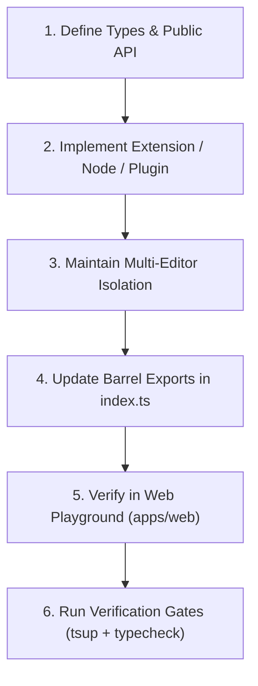
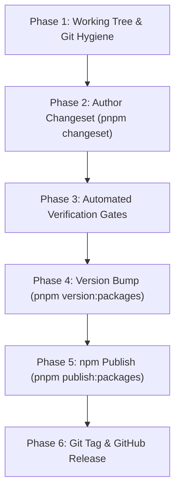

# Library Development, Version Control, and Publishing Protocol

## 1. Overview and Core Philosophy

Developing a shared library like `@vats-editor/core` requires a higher standard of architectural discipline than building an application. Library modifications directly affect external consumers who depend on predictable public APIs, strict TypeScript definitions, clean bundle sizes, and uninterrupted backward compatibility.

```text
Library Architecture & Distribution Pipeline:
packages/headless/ (Core Package)
  ├── src/components/   -> Headless React primitives (EditorRoot, EditorContent, EditorBubble, EditorCommand)
  ├── src/extensions/   -> Modular Tiptap nodes & marks (CodeBlock, Mathematics, Twitter, UpdatedImage)
  ├── src/plugins/      -> ProseMirror plugins (UploadImagesPlugin, CustomKeymap)
  └── src/utils/        -> Scoped Jotai store, Markdown serializer, URL helpers
        │
        ▼ (tsup dual bundle & dts emission)
      dist/
        ├── index.js    (ESM bundle for modern bundlers)
        ├── index.cjs   (CJS bundle for legacy Node/SSR runtimes)
        ├── index.d.ts  (ESM TypeScript declaration tree)
        └── index.d.cts (CJS TypeScript declaration tree)
        │
        ▼ (Changesets versioning & npm release)
      npm Registry (@vats-editor/core)
```

---

## 2. Public API Surface and Headless Design Principles

### 2.1 Headless Separation of Concerns
1. **Core is Unstyled**: `packages/headless` must provide behavior, node schemas, ProseMirror state handling, and accessibility primitives without imposing opinionated CSS frameworks or styles.
2. **Compound Component Pattern**: Keep components modular and composable (`EditorRoot` wraps `EditorContent`, `EditorBubble`, and `EditorCommand`).
3. **Multi-Editor Isolation**: Always scope state to the nearest `EditorRoot` context using isolated Jotai store instances. Never use module-level singleton atoms that bleed state across multiple editors on the same page.
4. **Explicit Barrel Exports**: Every public component, hook, utility function, extension, and TypeScript interface must be cleanly exported from `packages/headless/src/index.ts`.

---

## 3. Developing Changes in the Core Package (`packages/headless`)

Follow this exact sequence when implementing features or fixes in the library:



### 3.1 Adding or Modifying Extensions
1. Create the extension in `packages/headless/src/extensions/<extension-name>.tsx`.
2. Define explicit configuration options interface (e.g. `CodeBlockOptions`).
3. If the extension requires a custom React NodeView, create the component in `packages/headless/src/components/<component-name>.tsx` using `ReactNodeViewRenderer`.
4. Export the extension and types in `packages/headless/src/extensions/index.ts` and `packages/headless/src/index.ts`.

### 3.2 Dual Bundling and Declaration Emission (`tsup`)
The core package uses `tsup` for high-performance dual ESM and CJS compilation:

```bash
# Build the headless package and generate DTS declaration trees
pnpm --filter @vats-editor/core build
```

Verify that `packages/headless/dist/` contains:
- `index.js` (ESM module)
- `index.cjs` (CommonJS module)
- `index.d.ts` and `index.d.cts` (Type definitions)

---

## 4. Library Version Control: Semantic Versioning (MAJOR.MINOR.PATCH)

Vats Editor strictly enforces Semantic Versioning (`0.0.0` or `MAJOR.MINOR.PATCH`). Every release must adhere to the semantic contract to prevent breaking downstream applications.

```text
Version Format: MAJOR . MINOR . PATCH (e.g., 1.2.3)
                 │       │       │
                 │       │       └── Backward-compatible bug fixes and optimizations
                 │       └────────── Backward-compatible new features, props, and extensions
                 └────────────────── Incompatible breaking API or schema changes
```

---

### 4.1 MAJOR Version Bumps (`X.0.0`)

A MAJOR bump indicates breaking changes where consumers must modify their application code or document storage formats upon upgrading.

#### ✅ WHEN TO BUMP MAJOR:
- **Removing or Renaming Props**: Removing or renaming props on public components (`EditorRoot`, `EditorContent`, `EditorBubble`, `EditorCommand`, `ImageResizer`).
- **Altering Node/Mark Schemas**: Changing ProseMirror node names or attribute types in ways that invalidate stored JSON documents (e.g. renaming `updatedImage` to `image` or changing attribute data formats).
- **Altering Public Hooks & Utilities**: Modifying return signatures or arguments of public hooks (`useEditor`) or utilities (`getAllContent`).
- **Incompatible State Restructuring**: Changing Jotai store topology or provider mechanics in a backward-incompatible way.
- **Dropping Platform/Dependency Support**: Dropping support for Node versions or major React versions (e.g. dropping React 18 support).

#### 🛑 WHEN NOT TO BUMP MAJOR:
- Adding new optional props or extensions backward-compatibly (that is a MINOR bump).
- Refactoring internal helper functions with zero impact on public exports (that is a PATCH bump).
- Fixing bugs in parsing or rendering logic without altering public APIs (that is a PATCH bump).

#### 📋 MANDATORY REQUIREMENTS FOR MAJOR RELEASES:
1. **Architecture Decision Record (ADR)**: Author an ADR in `docs/decisions/ADR-00X-*.md` detailing the rationale for the breaking change.
2. **Migration Guide**: Write step-by-step upgrade instructions with before and after code examples in `docs/migration-guide.md`.
3. **Deprecation Period**: Whenever feasible, mark APIs as `@deprecated` in a prior minor version before complete removal.

---

### 4.2 MINOR Version Bumps (`X.Y.0`)

A MINOR bump indicates new functionality added in a fully backward-compatible manner. Existing consumer implementations will continue to work without modification.

#### ✅ WHEN TO BUMP MINOR:
- **New Built-in Extensions**: Adding new Tiptap extensions (e.g. `Mathematics`, `CodeBlock`, `TwitterEmbed`).
- **New Optional Component Props**: Adding optional props to existing components (e.g. adding `slotAfter` or `editable` to `EditorContent`).
- **New Exported Utilities or Hooks**: Adding new helper functions, state selectors, or custom ProseMirror plugins.
- **New Theme Tokens & CSS Selectors**: Introducing new theme custom properties or styling classes backward-compatibly.
- **New Command Palette Items**: Adding default slash command options without breaking custom suggestion lists.

#### 🛑 WHEN NOT TO BUMP MINOR:
- If any existing prop is removed or default behavior breaks existing consumer code (that is a MAJOR bump).
- If the change is solely a bug fix, performance enhancement, or dependency update without new features (that is a PATCH bump).

#### 📋 MANDATORY REQUIREMENTS FOR MINOR RELEASES:
1. Update API reference documentation in `docs/component-api.md` and `docs/extensions.md`.
2. Update matching GitHub Wiki pages (`wiki/Extensions-and-Plugins.md`, `wiki/Component-API-Reference.md`).

---

### 4.3 PATCH Version Bumps (`X.Y.Z`)

A PATCH bump indicates backward-compatible bug fixes, performance optimizations, or internal maintenance with zero changes to public APIs.

#### ✅ WHEN TO BUMP PATCH:
- **Bug Fixes**: Fixing parsing glitches, image upload race conditions, selection loss, or drag-and-drop issues.
- **Performance Optimizations**: Memoization tuning, debounce adjustments, bundle size reduction, or loop optimizations.
- **Type Inaccuracies**: Correcting TypeScript definition files (`.d.ts`) to match existing runtime behavior.
- **Internal Dependency Upgrades**: Patching internal dependencies without altering the exported API surface.
- **KaTeX / Syntax Highlighting Fixes**: Correcting regex patterns or LaTeX formula escaping without altering extension schemas.

#### 🛑 WHEN NOT TO BUMP PATCH:
- If a new prop, extension, or utility function is exported (that is a MINOR bump).
- If any existing consumer code would break or require modification (that is a MAJOR bump).

---

### 4.4 SemVer Decision Matrix Summary

| Change Type | Version Bump | Breaking? | Migration Guide Needed? |
| :--- | :--- | :--- | :--- |
| Remove or rename public component prop | **MAJOR** (`+1.0.0`) | **YES** | **YES** (`docs/migration-guide.md`) |
| Change ProseMirror node/mark schema name | **MAJOR** (`+1.0.0`) | **YES** | **YES** (Includes JSON schema transform) |
| Alter public hook return type | **MAJOR** (`+1.0.0`) | **YES** | **YES** |
| Add new optional component prop | **MINOR** (`0.+1.0`) | NO | NO (Update API reference) |
| Add new built-in Tiptap extension | **MINOR** (`0.+1.0`) | NO | NO (Update extension docs) |
| Add new exported helper utility | **MINOR** (`0.+1.0`) | NO | NO (Update docs and wiki) |
| Fix race condition in image upload | **PATCH** (`0.0.+1`) | NO | NO |
| Optimize memoization in bubble menu | **PATCH** (`0.0.+1`) | NO | NO |
| Fix inaccurate TypeScript interface | **PATCH** (`0.0.+1`) | NO | NO |

---

## 5. Publishing a New Version: Step-by-Step Release Protocol

Follow this exact 6-phase protocol for releasing and publishing packages to the npm registry:



---

### Phase 1: Working Tree and Branch Hygiene
Ensure that your local working branch is clean and synchronized with the remote repository:

```bash
# 1. Verify clean working tree
git status

# 2. Sync with remote tracking branch
git fetch origin
git pull origin main
```

---

### Phase 2: Authoring the Changeset
Changesets capture the semantic impact of the change along with user-facing release notes:

```bash
# Generate a new changeset entry
pnpm changeset
```

When prompted by the interactive CLI:
1. Select `@vats-editor/core` using the spacebar and press Enter.
2. Select the SemVer bump type based on Section 4:
   - `major` for breaking changes
   - `minor` for new features or extensions
   - `patch` for bug fixes and performance improvements
3. Write a clear, concise release summary explaining what changed and how consumers can use it.

---

### Phase 3: Pre-Publish Automated Verification Gates
Never publish a package without passing all verification gates locally:

```bash
# 1. Run monorepo typecheck
pnpm typecheck

# 2. Run Biome linter
pnpm lint

# 3. Clean and build all packages
pnpm build

# 4. Dry-run tarball inspection to verify bundled files
cd packages/headless && pnpm publish --dry-run
```

Ensure the dry-run output contains:
- `dist/index.js` and `dist/index.cjs`
- `dist/index.d.ts` and `dist/index.d.cts`
- `package.json` with correct export maps
- `README.md` and `LICENSE`

---

### Phase 4: Version Bumping and Changelog Generation
Execute the automated versioning command:

```bash
# Consume changesets, bump package.json version, and generate CHANGELOG.md
pnpm version:packages

# Review generated changelog and version bump
git diff packages/headless/package.json
git diff packages/headless/CHANGELOG.md
```

---

### Phase 5: Executing the npm Release
Publish the compiled package to the public npm registry:

```bash
# Publish updated packages with public access
pnpm publish:packages
```

---

### Phase 6: Git Tagging and GitHub Release
After a successful npm publication, record the release in git and GitHub:

```bash
# 1. Commit version bump and changelog
git add .
git commit -m "release(core): v1.x.x"

# 2. Create git release tag
git tag v1.x.x

# 3. Push commit and tag to remote repository
git push origin main --tags

# 4. Verify published package on npm
npm view @vats-editor/core version
```

---

## 6. Pre-Release Channels (Alpha / Beta / Canary)

When testing experimental features or major architectural refactors prior to a stable release, use pre-release channels:

```bash
# Enter pre-release mode for alpha channel
pnpm changeset pre enter alpha

# Create changesets as normal
pnpm changeset

# Version pre-release packages (e.g. v1.1.0-alpha.0)
pnpm version:packages

# Publish to npm under alpha distribution tag
pnpm publish:packages --tag alpha

# Exit pre-release mode when ready for stable release
pnpm changeset pre exit
```

---

## 7. Comprehensive DOs and DON'Ts Matrix

| Area | DO | DON'T |
| :--- | :--- | :--- |
| **API Design** | **DO** export strict TypeScript interfaces for all component props and extension options. | **DON'T** use `any`, loose object types, or unexported internal interfaces in public signatures. |
| **Styling** | **DO** keep core headless and pass class names through props and Tailwind CSS selectors. | **DON'T** embed hardcoded inline styles or force specific CSS frameworks inside headless components. |
| **Dependencies** | **DO** mark shared companion libraries (like React or KaTeX) as peer dependencies where appropriate. | **DON'T** add heavy transitive dependencies that inflate the consumer bundle size. |
| **Store State** | **DO** scope state stores to `EditorRoot` context to support multiple independent editors. | **DON'T** use global singleton atoms or module-level shared mutable state across editor instances. |
| **Bundling** | **DO** produce clean dual ESM and CJS bundles with full `.d.ts` declaration maps via `tsup`. | **DON'T** publish uncompiled TypeScript files, raw JSX, or single-format bundles. |
| **SemVer Discipline** | **DO** bump MAJOR for breaking prop/schema changes, MINOR for features, and PATCH for fixes. | **DON'T** release breaking API changes under minor or patch version bumps. |
| **Changesets** | **DO** write clear, user-facing summary notes in changesets explaining the impact of the change. | **DON'T** manually edit `version` in `package.json` without running the Changesets workflow. |
| **Pre-Publish Gates** | **DO** verify `pnpm typecheck`, `pnpm lint`, `pnpm build`, and dry-run pack before publishing. | **DON'T** publish packages from dirty git working trees or with uncommitted local changes. |
| **Publish Access** | **DO** publish scoped packages using `--access public` and provenance. | **DON'T** publish packages without verifying that credentials and 2FA tokens are active. |
| **Documentation** | **DO** update docs, ADRs, and GitHub Wiki in exact sync with code exports. | **DON'T** leave outdated code snippets or broken import paths in public guides. |
| **Migration Guides** | **DO** provide clear before and after code snippets in `docs/migration-guide.md` for major releases. | **DON'T** introduce breaking changes without giving consumers an actionable upgrade path. |
| **Writing Style** | **DO** use clear, technical language with zero forbidden dashes and zero AI buzzwords. | **DON'T** use promotional fluff or unsubstantiated marketing claims in technical docs. |
